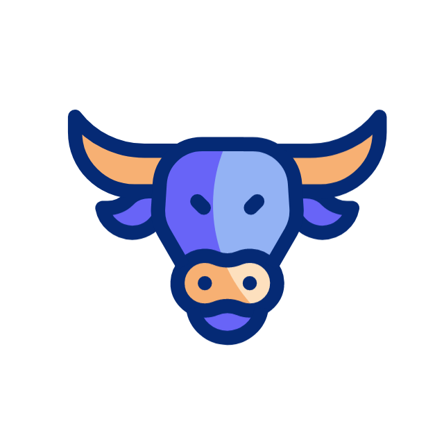
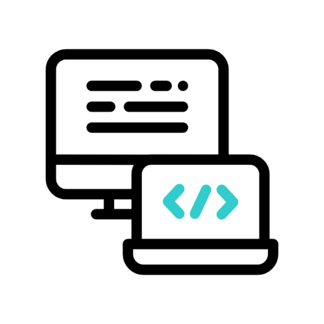
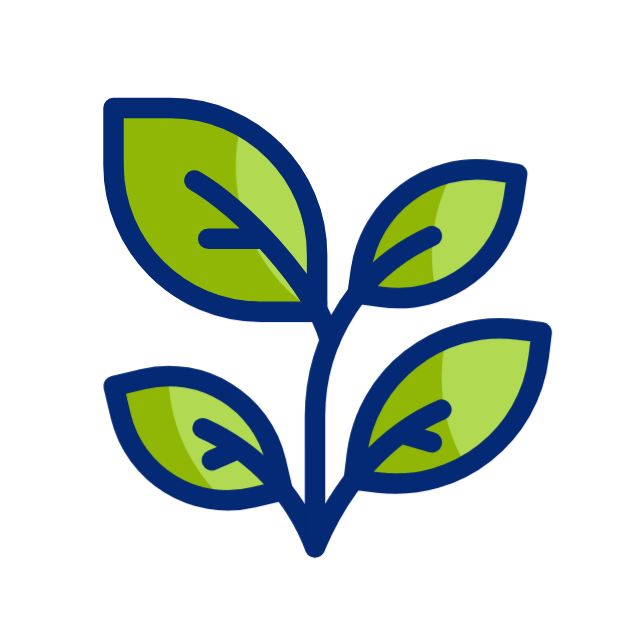

### &nbsp;About Me

 &nbsp;I'm currently studying Computer Science and Entrepreneurship at the University of South Florida.\
 &nbsp;I'm currently learning SQL, Database and Artificial Intelligence Algorithms.\
  &nbsp;In my free time, I pursue Art and Gardening as hobbies.

### 🛠 &nbsp;Tech Stack
#### Languages

#### Tools

### ⚙️ &nbsp;GitHub Analytics

### 🤝🏻 &nbsp;Connect with Me

